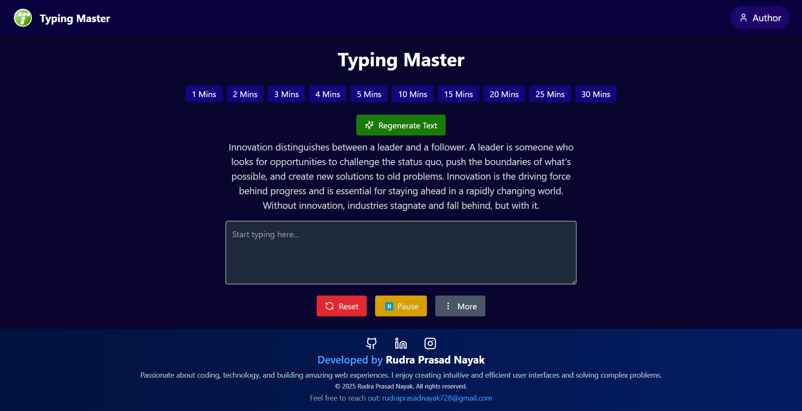

# Typing Master

**Typing Master** is a modern, responsive, and fully-featured typing test application built with React, Vite, and Tailwind CSS. It helps users practice typing, enhance their speed and accuracy, and monitor performance through real-time statistics and result summaries.

## 🚀 Features

- ⏱️ **Typing Test with Timer**: Choose a custom test duration (1 to 30 minutes) and type a randomly generated paragraph.
- 📈 **Real-Time Statistics**: Displays WPM (words per minute), character count, accuracy percentage, and error count while typing.
- 🔄 **Pause & Resume**: You can pause the test and resume without losing current progress.
- ✅ **Result Summary**: After completion, a popup displays your performance summary.
- 🔀 **Dynamic Paragraphs**: Generates new random content each session to keep the challenge fresh.
- 🧩 **Responsive UI**: Mobile-friendly design with clean layout and smooth transitions.
- 🎯 **Keyboard Navigation Support**: Enhanced accessibility with keyboard support.

## 🚀 Technologies Used

- ⚛️ **React.js** – Frontend framework for building the UI
- 💨 **Tailwind CSS** – Utility-first CSS for rapid and responsive styling
- 🌐 **React Router** – For navigation between different app pages (if used)
- ⏱️ **Custom Timer Logic** – For countdown-based typing sessions
- 📊 **State Management** – Using React hooks (`useState`, `useEffect`) for accuracy/speed tracking
- ⚡ **Vite** – Fast development build tool for modern frontend projects

## 🌐 Live Preview



## 📁 Folder Structure

```
/public

/src
   /assets
   /components
      Footer.jsx
      Navbar.jsx
      ResultPopup.jsx
      Timer.jsx
      TypingArea.jsx
   /data
      paragraphs.js
   App.jsx
```

## 🛠️ Installation & Usage

1. **Clone the repository**

   ```bash
   git clone https://github.com/Rudra-Prasad-Nayak/Typing_Master.git
   cd Typing_Master
   ```

2. **Install dependencies**

   ```bash
   npm install
   ```

3. **Start the development server**

   ```bash
   npm run dev
   ```

4. **Build for production:**

   ```bash
   npm run build
   ```

## 🧪 Usage

1. Launch the app and select your desired typing duration.
2. Start typing the paragraph shown on the screen.
3. Monitor your speed and accuracy in real-time.
4. View your results once the timer ends.
5. Switch between light and dark mode anytime using the toggle button in the navbar.

## 🔮 Future Enhancements

- 🌗 **Dark/Light Mode**
- 📝 **Custom Paragraph Input**
- 🏆 **Leaderboard for Global Scores**
- 🌍 **Multi-Language Support**
- 👤 **User Profiles with History**
- 🎓 **Typing Lessons & Challenges**
- 📱 **Mobile App Version** (React Native or Flutter)
- 🔊 **Sound Feedback for Keystrokes**
- 📊 **Charts & Analytics for Progress Tracking**

## 🤝 Contribution

Feel free to fork this repo, raise issues, or submit pull requests. All contributions are welcome!

## 🔗 Connect with Me

- [🌐 GitHub](https://github.com/Rudra-Prasad-Nayak)
- [💼 LinkedIn](https://www.linkedin.com/in/RudraPrasadNayak728/)
- [☕ Buy Me a Coffee](https://buymeacoffee.com/rudraprasa3)

## 🙌 Appreciate My Work?

If you found this project helpful or inspiring:

- ⭐ Drop a **star** on [GitHub](https://github.com/Rudra-Prasad-Nayak/Typing_Master)
- ☕ Support me on [Buy Me a Coffee](https://buymeacoffee.com/rudraprasa3)

Your support motivates me to build more cool stuff! 💖

## 📄 License

This project is licensed under the **MIT License**.
See the [LICENSE](./LICENSE) file for full details.

## 💬 Feedback

Feel free to share your thoughts, improvements, or feature ideas! I’d love to hear from you.

## Conclusion

Thank you for checking out the **Typing Master** app! I hope it helps you improve your typing skills. For any issues or suggestions, please open an issue on GitHub.

Enjoy Typing Master? Give it a ⭐ on GitHub!
